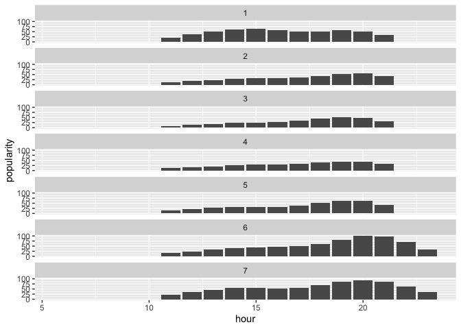

<!-- README.md is generated from README.Rmd. Please edit that file -->

# populartimes

<!-- badges: start -->

<!-- badges: end -->

populartimes is an R translation of the wonderful python
[library](https://github.com/m-wrzr/populartimes) of the same name. This
package is more limited in scope as it does not have a function or
searching by spatial area. The package
[googleway](https://github.com/SymbolixAU/googleway) does this already.

## Installation

You can install the deve;opment version of populartimes from with:

``` r
# install.packages("devtools")
devtools::install_github("JosiahParry/populartimes")
```

There is a single function that is provided by this library:
`get_popular_times()`. There are two arguments:

  - `place_id`: The unique Google Maps identifier. See
    [docs](https://developers.google.com/maps/documentation/javascript/examples/places-placeid-finder)
    for app to provide place ID.
  - Google API key from <https://console.cloud.google.com/>. Ensure
    Places API is enabled.

The easiest way to utilize this is by setting the environment variable
`GOOGLE_KEY` to your key value. For example `Sys.setenv("GOOGLE_KEY" =
"your-key-value")` or by using an .Renviron file. You can get a key by
following [these
instructions](https://developers.google.com/places/web-service/get-api-key).

## Example

### Search and area for popular times

``` r
library(populartimes)
library(tidyverse)

sw <- c(42.988690, -71.465834)
ne <- c(42.995119, -71.455745)

manch_bars <- search_pop_times(sw, ne, radius = 200, type = "bar")
```

``` r
manch_bars %>% 
  filter(name == "Thirsty Moose Taphouse Manchester") %>% 
  unnest(popular_times) %>% 
  ggplot(aes(hour, popularity)) +
  geom_col() + 
  facet_wrap(c("day_of_week"), ncol = 1)
```



### Search an area for places

Note that `get_places()` does not implement a search grid. You are
limited to the nearest 60 results regardless of radius.

``` r
get_places(ne, radius = 200)
#> # A tibble: 60 x 11
#>    place_id name    lat  long vicinity types rating n_ratings price_level
#>    <chr>    <chr> <dbl> <dbl> <chr>    <lis>  <dbl>     <int>       <int>
#>  1 ChIJo2x… Manc…  43.0 -71.5 Manches… <chr…   NA          NA          NA
#>  2 ChIJaXa… Ash …  43.0 -71.5 118 Ash… <chr…    4.6        27          NA
#>  3 ChIJRfg… La C…  43.0 -71.5 103 Wal… <chr…    4           1          NA
#>  4 ChIJG2E… Grea…  43.0 -71.5 170 Low… <chr…    3           2          NA
#>  5 ChIJ8zX… Clea…  43.0 -71.5 154 Bri… <chr…    4.2        12          NA
#>  6 ChIJWaY… Ash …  43.0 -71.5 Manches… <chr…   NA          NA          NA
#>  7 ChIJUej… Ligh…  43.0 -71.5 615 Uni… <chr…   NA          NA          NA
#>  8 ChIJK-X… Unio…  43.0 -71.5 610 Uni… <chr…    3.7         3          NA
#>  9 ChIJm0_… The …  43.0 -71.5 High St… <chr…   NA          NA          NA
#> 10 ChIJVVV… Mich…  43.0 -71.5 587 Uni… <chr…    1           7          NA
#> # … with 50 more rows, and 2 more variables: business_status <chr>,
#> #   photos <list>
```

#### Get popular times for a given place

``` r
get_popular_times("ChIJywwlXCZP4okRQTupAgSLMSI") %>% 
  select(name, popular_times)
#> # A tibble: 1 x 2
#>   name                            popular_times     
#>   <chr>                           <list>            
#> 1 The Shaskeen Pub and Restaurant <tibble [133 × 3]>
```
